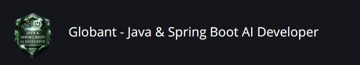

# Globant-Java&Spring-Boot-AI-Developer
Globant - Java & Spring Boot AI Developer

# Detalhes do bootcamp
Aprenda a desenvolver aplicações back-end modernas com Java e Spring Boot, explorando desde os fundamentos da linguagem até a criação de APIs completas e integradas a bancos de dados. Descubra como aplicar boas práticas amplamente utilizadas no mercado, como Clean Code e padrões de projeto, enquanto constrói soluções reais e evolui suas habilidades técnicas na prática.

Desenvolva projetos para o seu portfólio, aprenda com especialistas da área e descubra como utilizar ferramentas e tecnologias que fazem parte do dia a dia de profissionais de tecnologia. Prepare-se para novos desafios, fortaleça seu conhecimento e dê o próximo passo na sua jornada como desenvolvedor.

Desafio de Código: Desafios práticos de programação para você aplicar o que aprendeu nos cursos, resolvendo problemas reais e desenvolvendo seu raciocínio lógico e suas habilidades técnicas.

Desafio de Projeto: Projetos completos em que você reúne tudo o que aprendeu em diferentes conteúdos para resolver um problema real, criando uma entrega final que pode fazer parte do seu portfólio.

# Ferramentas para o seu aprendizado:
Meta de estudo: Permite planejar sua rotina de estudos, definindo quantos dias por semana você quer avançar no bootcamp. A partir disso, a plataforma calcula o tempo estimado para concluir todas as atividades e obter o certificado.
